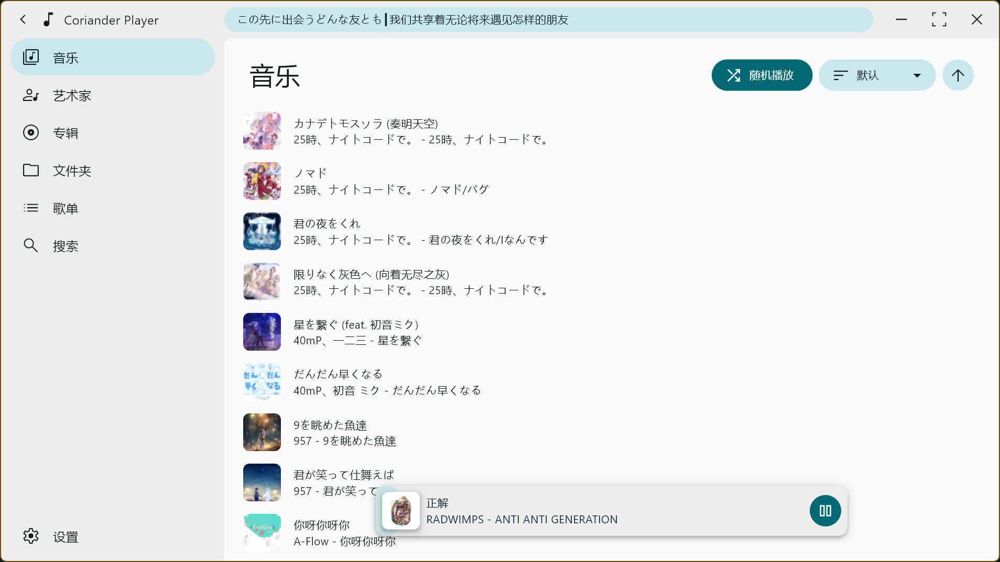
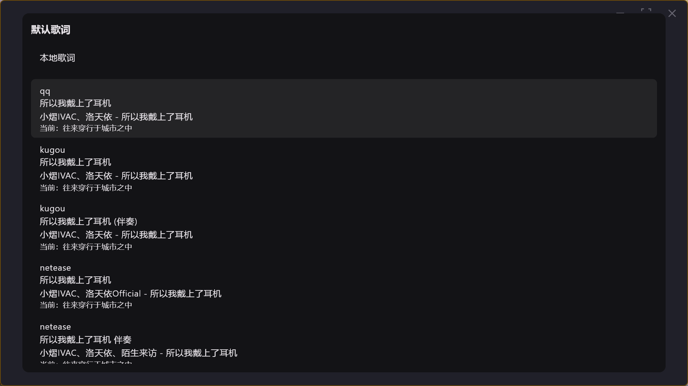

# coriander_player


一款使用 Material You 配色的本地音乐播放器

### 特色
详见 [官网](https://ferry-200.github.io/coriander_player_website/#second)

### 安装
1. 下载 [Release](https://github.com/Ferry-200/coriander_player/releases) 里的发行版，直接双击release.zip里的exe运行
2. 下载 [Release](https://github.com/Ferry-200/coriander_player/releases) 里的 msix 文件，按照 [MSIX_install使用方法](MSIX_install.md) 安装

### 歌词特性解释
1. lrc歌词的间奏识别   
   在一些lrc歌词中，会使用 **只有时间标签而内容为空** 的一行来表示上一行的结束。如：
   ```
   [02:32.57]光は やさしく抱きしめた
   [02:32.57]那天没能放声大哭的我
   [02:39.94]
   [02:55.18]照らされた世界 咲き誇る大切な人
   [02:55.18]光芒普照整个世界 珍重之人绽放于心
   ```
   如果这一行（第三行）的时间戳和下一行的时间戳之间大于5s，就把这两行之间的时间作为间奏时长  
   **所以，不是所有lrc歌词在间奏时都能显示间奏动画。**
2. krc、qrc逐字歌词的间奏识别  
   逐字歌词都会给出每一行的开始时间和持续时间，所以识别间奏会简单得多。如
   ```
   [5905,5466]<0,217,0>世<217,383,0>界<600,495,0>は<1095,272,0>と<1367,328,0>て<1695,343,0>も<2038,616,0>綺<2654,752,0>麗<3406,276,0>だ<3682,276,0>っ<3958,504,0>た<4462,1004,0>な
   [23037,5254]<0,255,0>書<255,280,0>架<535,312,0>の<847,592,0>隙<1439,312,0>間<1751,223,0>に<1974,160,0>住<2134,144,0>ま<2278,352,0>う<2630,640,0>一<3270,640,0>輪<3910,190,0>の<4100,680,0>花<4780,474,0>は
   ```
   第一行的开始时间是 5905ms，持续 5466ms；第二行则是 23037ms和 5254ms。可见 5905 + 5466 = 11371，与 23037相差超过 5000ms，所以这两行时间可以插入表示间奏的空白行

### 选择默认歌词
默认情况下，软件会先读取本地歌词。如果没有，则匹配在线歌词。你可以在正在播放界面下方的 “更多” 按钮中选择 “选择默认歌词” 来指定默认歌词。   


在这个界面中，你可以在本地歌词（如果有）和几个匹配程度高的在线歌词中选择一个作为默认歌词。之后再播放这首音乐时，软件会加载你指定的歌词。

### 感谢
本项目引用了 [music_api](https://github.com/yhsj0919/music_api.git) 来实现歌曲的匹配和歌词的获取