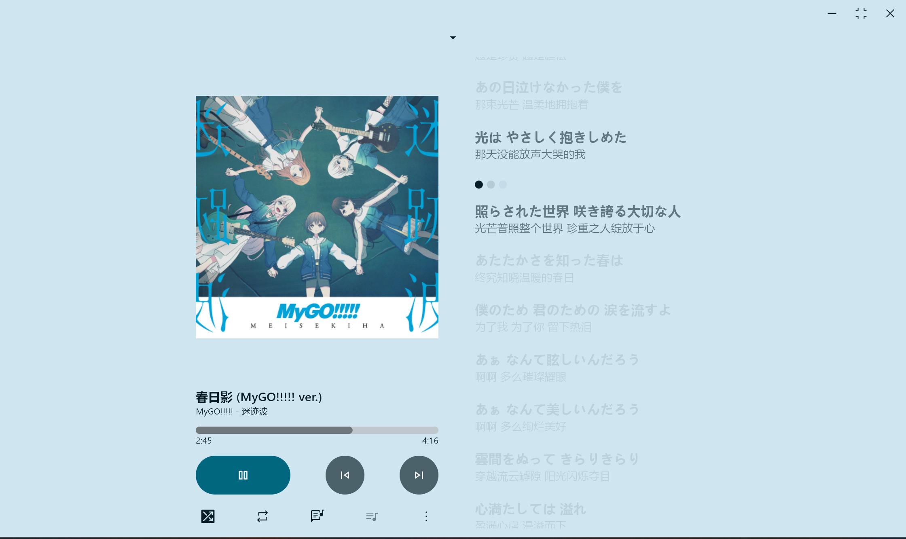

# coriander_player

一款使用 Material You 配色的本地音乐播放器

### 特色
- 根据歌曲封面配色
- 歌词栏
- 美观的歌词界面
- 跟 Apple Music 相似的间奏表示
  

### 安装
1. 下载 [Release](https://github.com/Ferry-200/coriander_player/releases) 里的发行版，直接双击release.zip里的exe运行
2. 下载 [Release](https://github.com/Ferry-200/coriander_player/releases) 里的 msix 文件，按照 [MSIX_install使用方法](MSIX_install.md) 安装