# Coriander Player：一款使用 Material You 配色的本地音乐播放器。
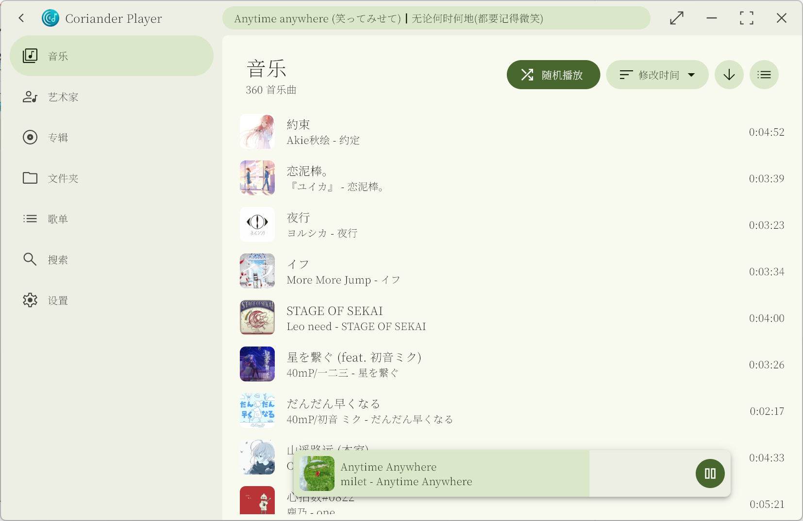

## [更多软件截图在下面（点我滚动到下面）](#软件截图)

**该播放器发行版已经附带桌面歌词组件。项目仓库请见 [desktop_lyric](https://github.com/Ferry-200/desktop_lyric.git)**

## 安装
1. 下载 [Release](https://github.com/Ferry-200/coriander_player/releases/latest) 里文件安装
2. **（已过时，现在的体验版已经落后于正式版）** 你也可以到 [Action 构建版本（体验版）介绍](https://github.com/Ferry-200/coriander_player/issues/49) 下载体验版 :)

## 支持播放的音乐格式
- mp3, mp2, mp1
- ogg
- wav, wave
- aif, aiff, aifc
- asf, wma
- aac, adts
- m4a
- ac3
- amr, 3ga
- flac
- mpc
- mid
- wv, wvc
- opus
- dsf, dff
- ape

## 支持下列音乐格式的内嵌歌词
- aac
- aiff
- flac
- m4a
- mp3
- ogg
- opus
- wav（标签必须用 UTF-8 编码）

其他格式的只支持同目录的 lrc 文件或者是网络歌词

## 选择默认歌词
默认情况下，软件会先读取本地歌词。如果没有，则匹配在线歌词。
你可以在正在播放界面的歌词切换按钮展开的菜单中进入选择默认歌词的页面。

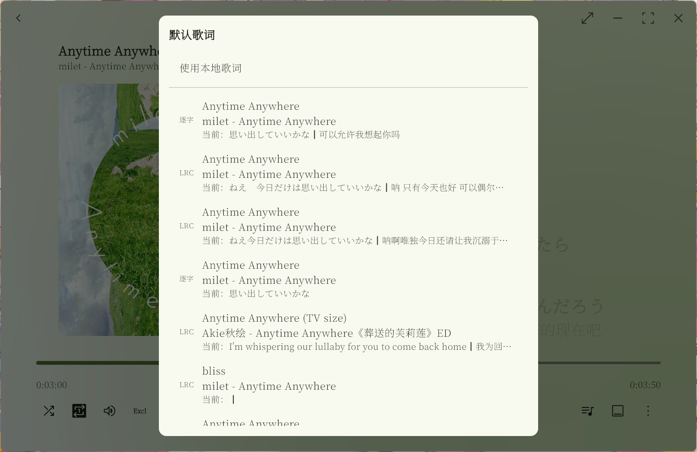
在这个界面中，你可以在本地歌词（如果有）和几个匹配程度高的在线歌词中选择一个作为默认歌词。之后再播放这首音乐时，软件会加载你指定的歌词。

## 提供建议、提交 Bug 或者提 PR
我正处于学习和适应 Github 工作流的阶段，所以目前不设置太多的要求。你只需要注意以下几点： 
1. 如果要提交 Bug，请创建一个新的 issue。尽可能说明复现步骤并提供截图。
2. 如果你提交 PR，由于我正在学习相关知识，可能会在处理 PR 时和你沟通如何操作分支之类的问题。

## 编译
1. 开发 flutter 需要的环境
2. 需要编译 Coriander Player（本仓库） 软件本体和 desktop_lyric。[desktop_lyric](https://github.com/Ferry-200/desktop_lyric.git) 也是 Flutter 应用，直接编译即可
3. 要把得到的 desktop_lyric 产物放在软件目录的 `desktop_lyric/` 目录下
4. 编译后要把 BASS 库的 64 位的 `bass.dll`, `bassape.dll`, `bassdsd.dll`, `bassflac.dll`, `bassmidi.dll`, `bassopus.dll`, `basswv.dll`, `basswasapi.dll` 放在软件目录的 `BASS` 文件夹下

## 歌词特性解释
1. lrc歌词的间奏识别   
   在一些lrc歌词中，会使用 **只有时间标签而内容为空** 的一行来表示上一行的结束。如：
   ```
   [02:32.57]光は やさしく抱きしめた
   [02:32.57]那天没能放声大哭的我
   [02:39.94]
   [02:55.18]照らされた世界 咲き誇る大切な人
   [02:55.18]光芒普照整个世界 珍重之人绽放于心
   ```
   如果这一行（第三行）的时间戳和下一行的时间戳之间大于5s，就把这两行之间的时间作为间奏时长  
   **所以，不是所有lrc歌词在间奏时都能显示间奏动画。**
2. 逐字歌词的间奏识别  
   逐字歌词都会给出每一行的开始时间和持续时间，所以识别间奏会简单得多。如
   ```
   [5905,5466]<0,217,0>世<217,383,0>界<600,495,0>は<1095,272,0>と<1367,328,0>て<1695,343,0>も<2038,616,0>綺<2654,752,0>麗<3406,276,0>だ<3682,276,0>っ<3958,504,0>た<4462,1004,0>な
   [23037,5254]<0,255,0>書<255,280,0>架<535,312,0>の<847,592,0>隙<1439,312,0>間<1751,223,0>に<1974,160,0>住<2134,144,0>ま<2278,352,0>う<2630,640,0>一<3270,640,0>輪<3910,190,0>の<4100,680,0>花<4780,474,0>は
   ```
   第一行的开始时间是 5905ms，持续 5466ms；第二行则是 23037ms和 5254ms。可见 5905 + 5466 = 11371，与 23037相差超过 5000ms，所以这两行时间可以插入表示间奏的空白行

## 感谢
- [music_api](https://github.com/yhsj0919/music_api.git)：实现歌曲的匹配和歌词的获取
- [Lofty](https://crates.io/crates/lofty)：歌曲标签获取
- [BASS](https://www.un4seen.com/bass.html)：播放乐曲
- [flutter_rust_bridge](https://pub.dev/packages/flutter_rust_bridge)：实现许多 Windows 原生交互
- [Silicon7921](https://github.com/Silicon7921)：绘制了新图标

## 软件截图

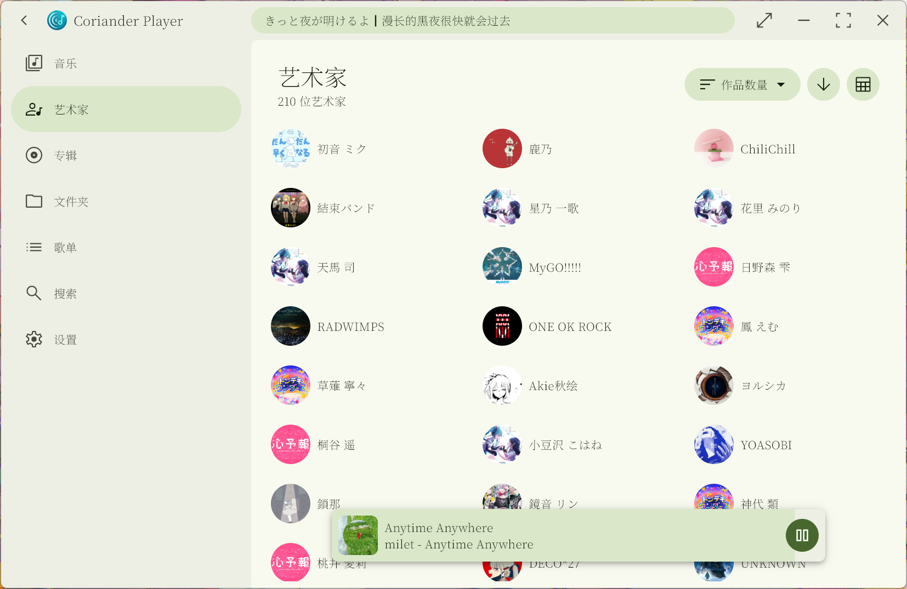
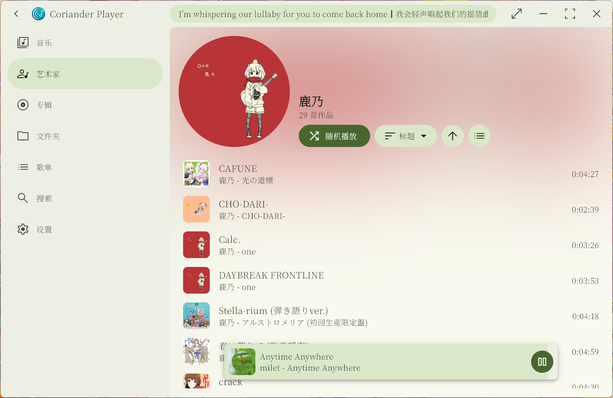
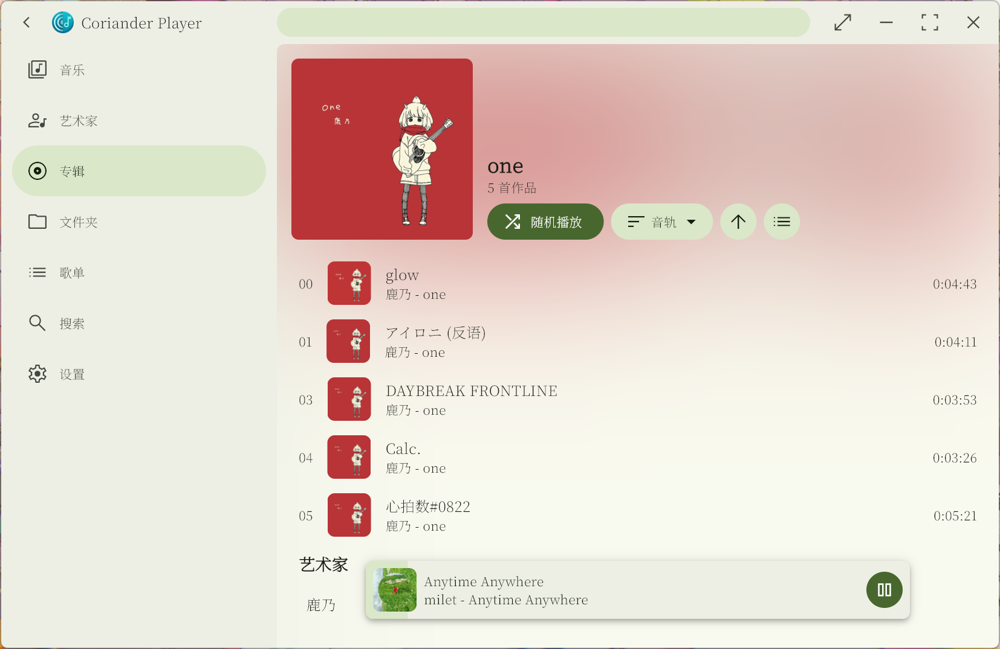
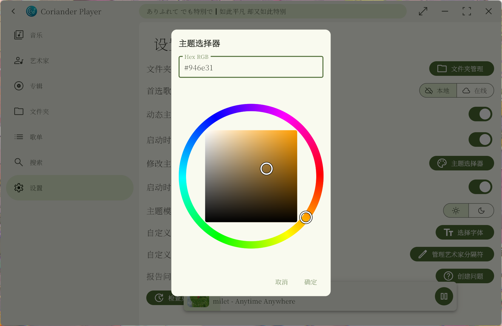
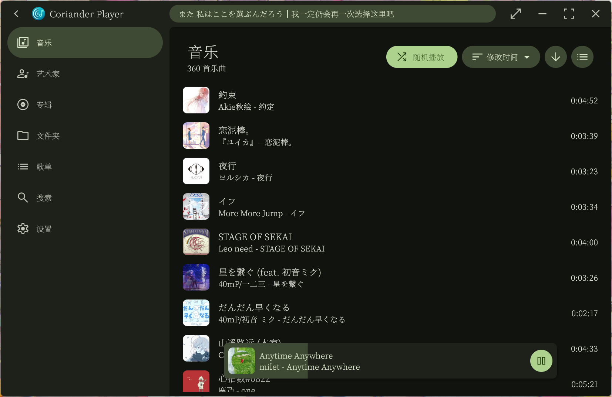
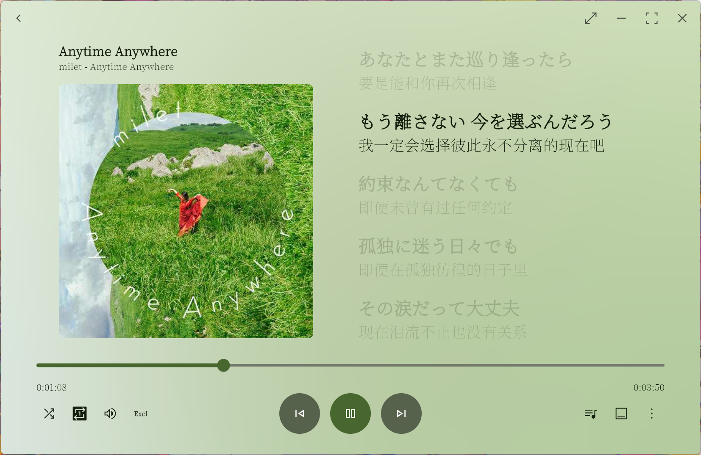
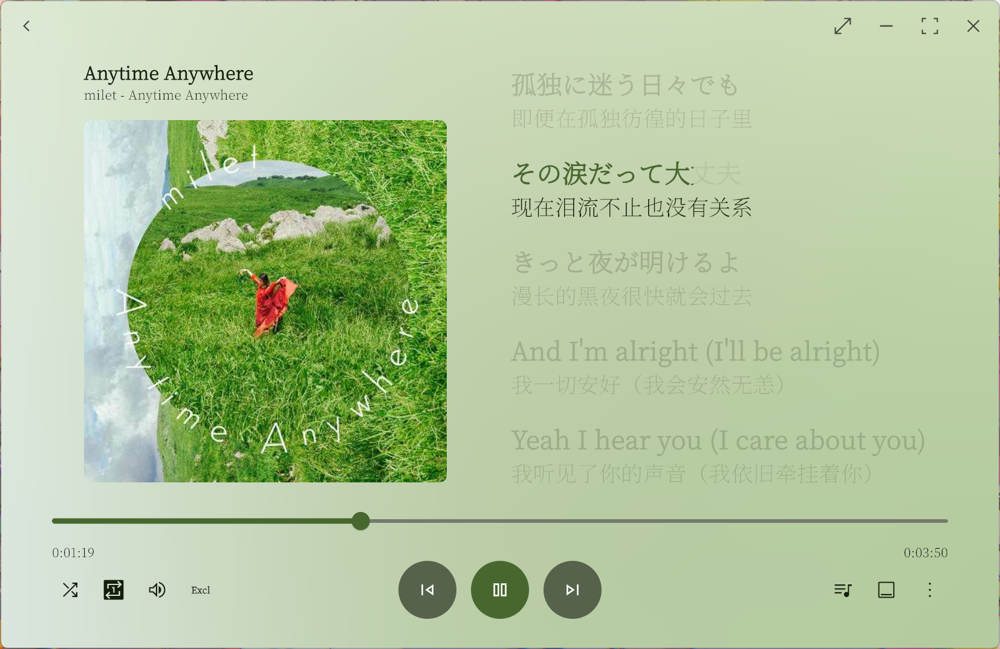
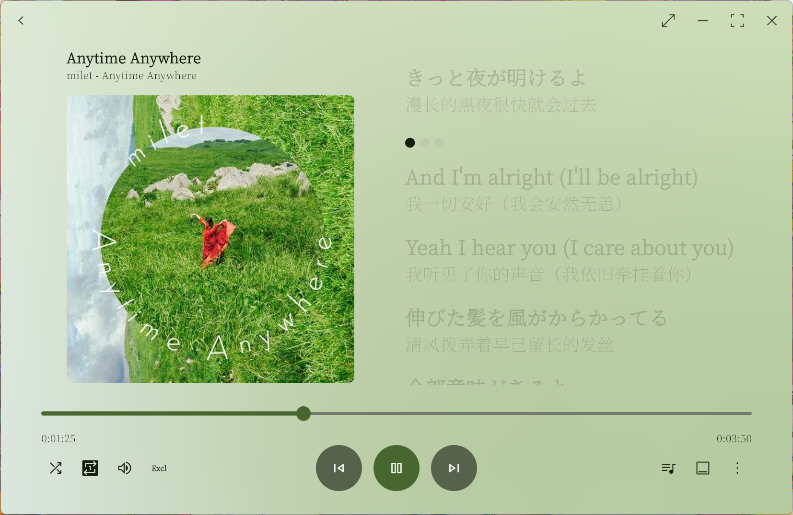
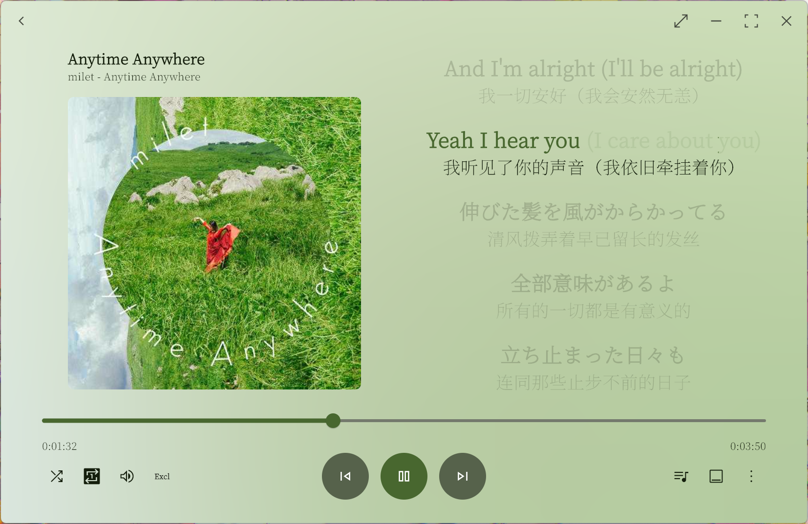
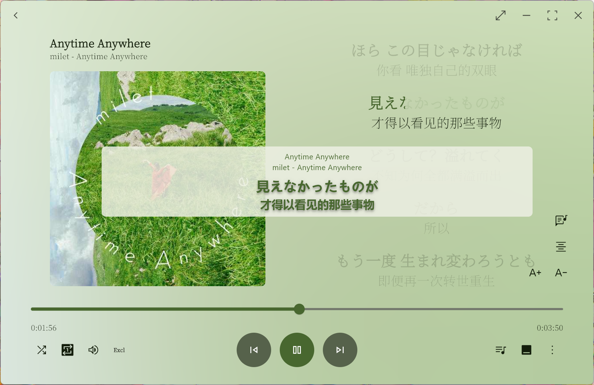

